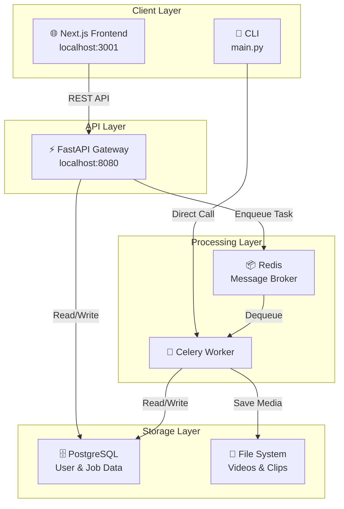
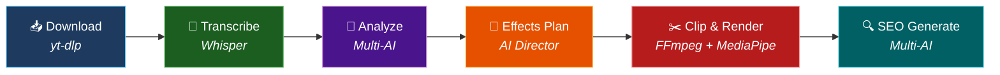
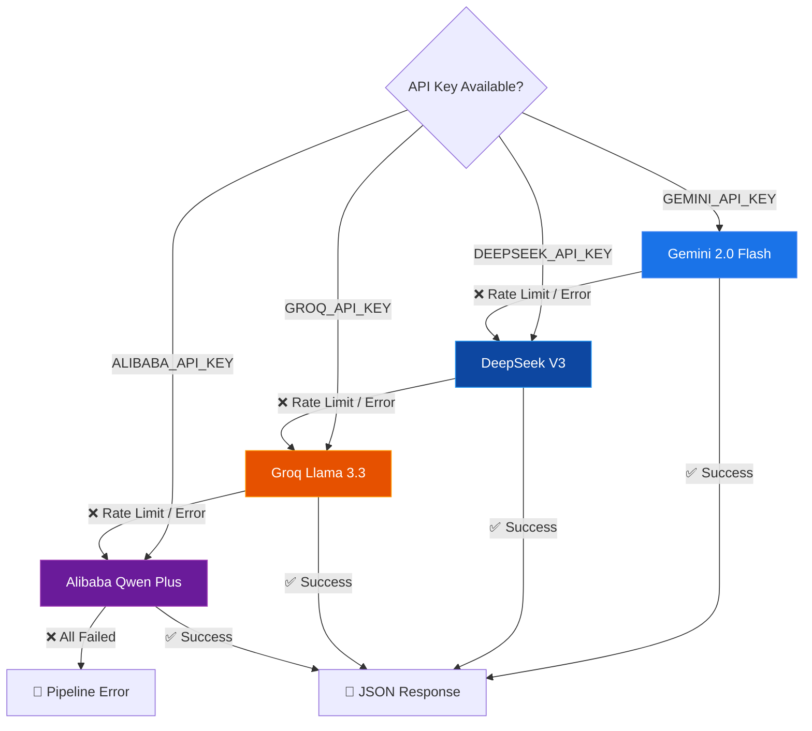
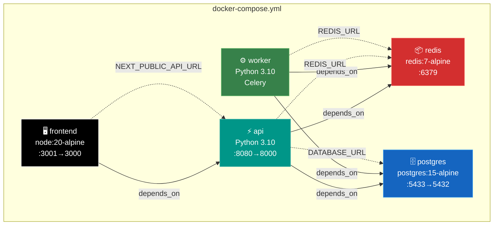
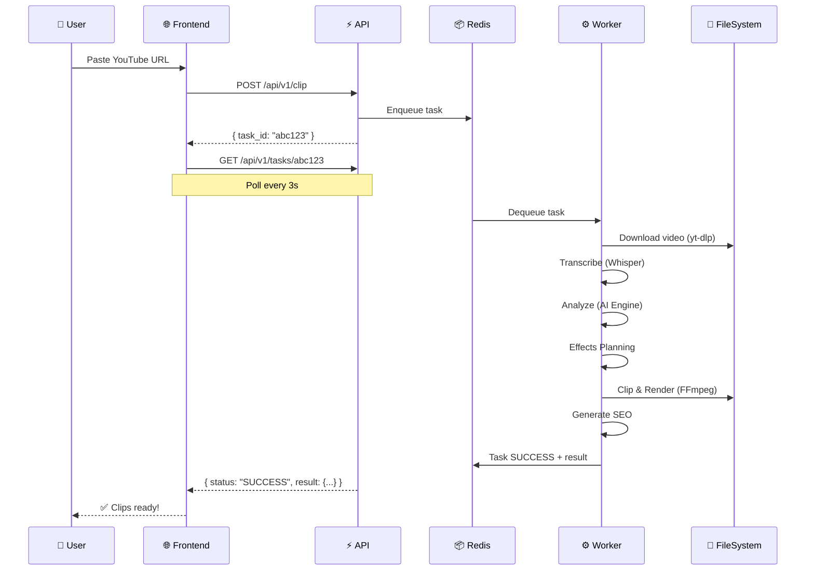
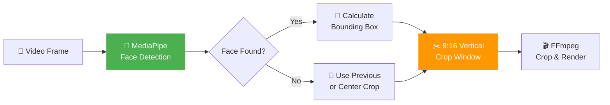

# 🏛️ Architecture — ViralClip

> Detailed technical architecture of the ViralClip platform.

---

## System Overview

ViralClip is built as a **distributed, event-driven microservices architecture** designed for horizontal scalability.

---

## Processing Pipeline

The core pipeline runs as a **6-stage sequential workflow** inside a Celery worker:

### Stage Details

| Stage | Module | Input | Output | AI Engine |
|-------|--------|-------|--------|-----------|
| 1. Download | `downloader.py` | YouTube URL | `.mp4` + `.mp3` | — |
| 2. Transcribe | `transcriber.py` | `.mp3` | `transcription.json` | Groq Whisper / Local Whisper |
| 3. Analyze | `analyzer.py` | `transcription.json` | `viral_moments.json` | Gemini → DeepSeek → Groq → Qwen |
| 4. Effects | `effects_director.py` | `viral_moments.json` | `effects.json` | Same fallback chain |
| 5. Clip | `clipper.py` | `.mp4` + all JSONs | Platform clips | — (FFmpeg + MediaPipe) |
| 6. SEO | `seo_generator.py` | All JSONs | `seo.json` | Same fallback chain |

---

## AI Engine Fallback Strategy

The engine manager implements a **strategy pattern with automatic fallback**:

### Engine Comparison

| Engine | Speed | Quality | Cost | Best For |
|--------|:-----:|:-------:|:----:|----------|
| Gemini 2.0 Flash | ⚡⚡⚡ | ★★★★★ | Free tier | Primary analysis |
| DeepSeek V3 | ⚡⚡ | ★★★★☆ | $0.14/1M tokens | Complex analysis |
| Groq Llama 3.3 | ⚡⚡⚡⚡ | ★★★☆☆ | Free tier | Fast iteration |
| Alibaba Qwen Plus | ⚡⚡ | ★★★★☆ | $0.10/1M tokens | Fallback |

---

## Docker Services Topology

---

## Data Flow

---

## Face Tracking Pipeline

---

## Tech Stack Summary

| Layer | Technology | Purpose |
|-------|-----------|---------|
| **Frontend** | Next.js 15, Tailwind CSS, shadcn/ui | Dashboard & Landing Page |
| **API** | FastAPI, Pydantic, Uvicorn | REST Gateway |
| **Queue** | Celery 5.4, Redis 7 | Async Task Processing |
| **Database** | PostgreSQL 15, SQLAlchemy, Alembic | Persistence |
| **AI** | Gemini, DeepSeek, Groq, Qwen | Analysis & Generation |
| **Video** | FFmpeg, yt-dlp | Download, Clip, Render |
| **ML** | MediaPipe, OpenAI Whisper | Face Tracking, Transcription |
| **Quality** | mypy, flake8, pytest | Type Safety & Testing |
| **Deploy** | Docker Compose | Orchestration |

---

## Security Considerations

- API keys stored in `.env` (never committed — protected by `.gitignore`)
- CORS restricted to `localhost:3000` and `localhost:3001`
- Pydantic validation on all API inputs
- No direct database exposure (only via API)
- Docker network isolation between services
